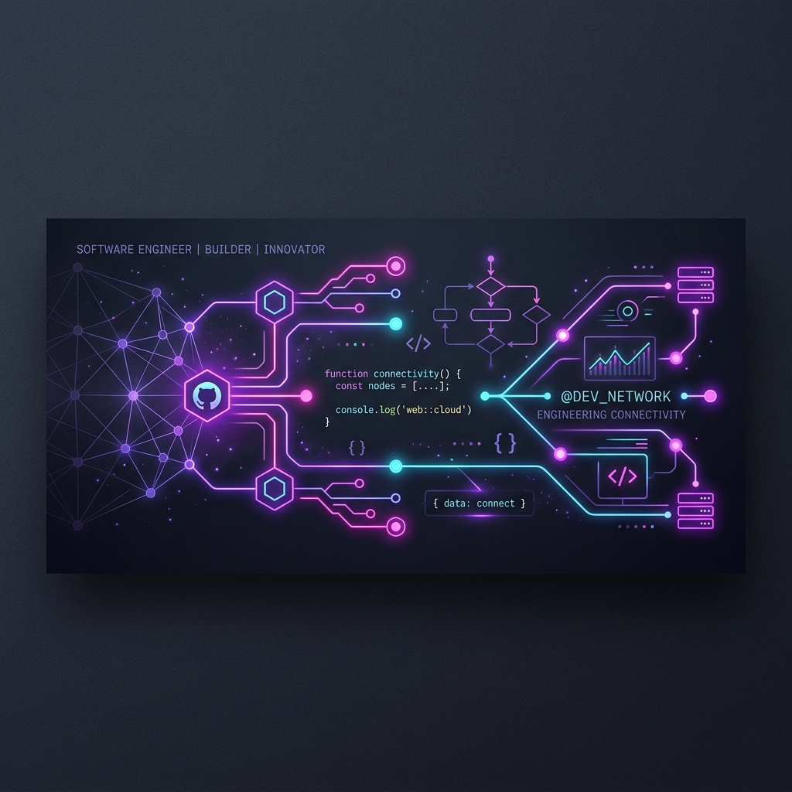

  <!-- Custom Header Banner -->
  

   

  <h1>Hi there, I'm Yathartha! 👋</h1>
  
  <h3>🚀 Full-Stack Developer | Competitive Programmer | Hackathon Enthusiast</h3>

  

    I am a passionate software engineer focused on building clean, high-performance web applications and solving complex algorithmic challenges. I love exploring new technologies, participating in hackathons, and developing utilities that make a difference.
  

  

    
  

## 🛠️ Tech Stack & Tools

<table>
  <tr>
    <td valign="top" width="33%">
      <h4>💻 Languages</h4>
      
       
      
       
      
       
      
       
      
       
      
    </td>
    <td valign="top" width="33%">
      <h4>⚙️ Frameworks & Libraries</h4>
      
       
      
       
      
       
      
    </td>
    <td valign="top" width="33%">
      <h4>🛠️ Tools & Environments</h4>
      
       
      
       
      
       
      
    </td>
  </tr>
</table>

## 🌟 Featured Projects

Here are some of the key projects I have built, showcasing web development, steganography, and cognitive tools:

<table align="center" border="0" cellpadding="8" cellspacing="8" width="100%">
  <tr>
    <td width="50%" valign="top" style="border: 1px solid #30363d; border-radius: 6px; padding: 16px; background-color: #0d1117;">
      <h3>🚀 <a href="https://github.com/yathartharastogi/DSA-Vault">DSA-Vault</a></h3>
      
A website that shows my Data Structures and Algorithms question progress with a minimal and clean UI that is easy to read and navigate through.

      
      
    </td>
    <td width="50%" valign="top" style="border: 1px solid #30363d; border-radius: 6px; padding: 16px; background-color: #0d1117;">
      <h3>📊 <a href="https://github.com/yathartharastogi/Github-Recapped">Github-Recapped</a></h3>
      
A fun website (inspired by Spotify Wrapped) to gain detailed insights and statistics on your own or someone else's public GitHub activity.

      
      
    </td>
  </tr>
  <tr>
    <td width="50%" valign="top" style="border: 1px solid #30363d; border-radius: 6px; padding: 16px; background-color: #0d1117;">
      <h3>⚡ <a href="https://github.com/yathartharastogi/NeuroCharge">NeuroCharge</a></h3>
      
Our submission for the Neuro Nex '26 Hackathon, built to optimize digital workspace configurations and enhance focus.

      
      
    </td>
    <td width="50%" valign="top" style="border: 1px solid #30363d; border-radius: 6px; padding: 16px; background-color: #0d1117;">
      <h3>🔒 <a href="https://github.com/yathartharastogi/steganoqr">steganoqr</a></h3>
      
Our submission for the PydroidX Hackathon. A security tool integrating image steganography and QR codes to securely conceal secret payloads.

      
    </td>
  </tr>
  <tr>
    <td width="50%" valign="top" style="border: 1px solid #30363d; border-radius: 6px; padding: 16px; background-color: #0d1117;">
      <h3>📂 <a href="https://github.com/yathartharastogi/digital-declutter">digital-declutter</a></h3>
      
An application made to help you seamlessly track and manage your online subscriptions in one organized place.

      
    </td>
    <td width="50%" valign="top" style="border: 1px solid #30363d; border-radius: 6px; padding: 16px; background-color: #0d1117;">
      <h3>📝 <a href="https://github.com/yathartharastogi/DSA-Problems">DSA-Problems</a></h3>
      
A structured repository containing the clean source code for all the various Data Structures and Algorithms problems I have solved.

      
    </td>
  </tr>
</table>

## 📈 GitHub Statistics & Activity

<table align="center" border="0" cellpadding="0" cellspacing="0">
  <tr>
    <td align="center" valign="top">
      
    </td>
    <td align="center" valign="top">
      
    </td>
  </tr>
  <tr>
    <td align="center" valign="top" colspan="2">
       
      
    </td>
  </tr>
</table>

  
💡 <i>"The best way to predict the future is to invent it."</i>

  Designed with ❤️ to showcase my coding journey.

